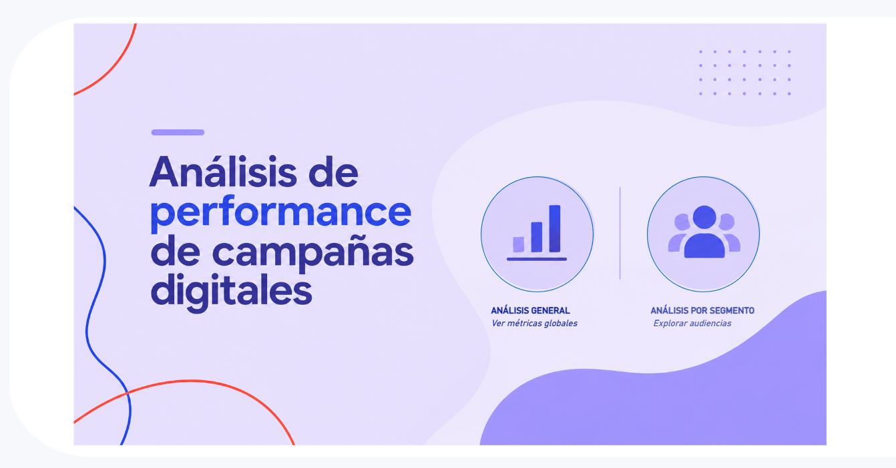
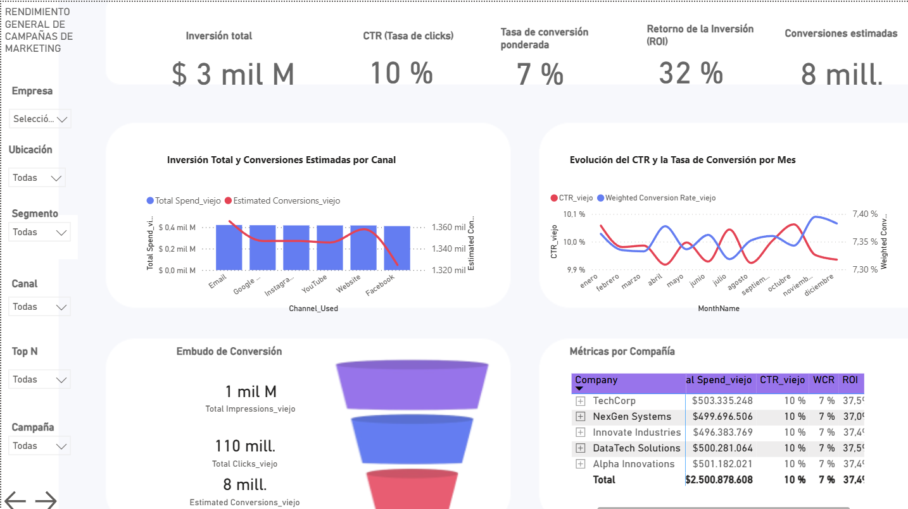
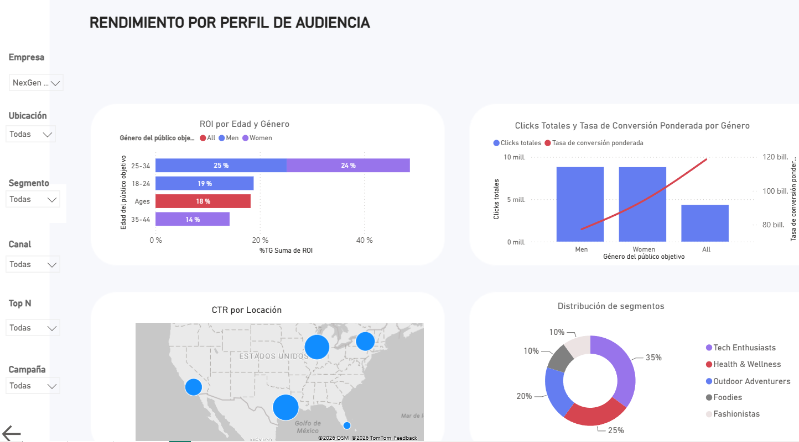

# 📊 Análisis de Performance de Campañas Digitales

Dashboard desarrollado en **Power BI** para analizar el rendimiento de campañas de marketing digital desde una perspectiva general y por perfil de audiencia.

El proyecto permite explorar los principales indicadores de performance, la evolución de las campañas y el comportamiento de distintos segmentos de audiencia.

---

## 🎯 Objetivo

Desarrollar una herramienta de análisis que permita obtener una visión integral del rendimiento de las campañas digitales y profundizar en el comportamiento de diferentes perfiles de audiencia.

El dashboard busca responder preguntas como:

- ¿Cuál es el rendimiento general de las campañas?
- ¿Cuánto se invirtió y qué retorno generó?
- ¿Cómo evolucionan el CTR y la tasa de conversión?
- ¿Qué canales concentran la inversión y las conversiones?
- ¿Cómo varía el rendimiento según el perfil de audiencia?
- ¿Qué segmentos presentan mayor participación?
- ¿Cómo se comportan las métricas según género, edad y ubicación?

---

## 🖥️ Dashboard

La navegación comienza desde una **portada interactiva** que permite acceder a dos vistas principales:

📊 **Análisis General**  
Visión global del rendimiento de las campañas, evolución temporal, canales, conversión y compañías.

👥 **Análisis por Segmento**  
Análisis del comportamiento de las campañas según diferentes perfiles de audiencia.



---

## 📈 Análisis General

La primera vista permite obtener una visión global de la performance de las campañas.

### Principales KPIs

- Inversión total
- CTR (Click Through Rate)
- Tasa de conversión ponderada
- ROI (Retorno de la Inversión)
- Conversiones estimadas

### Análisis incluidos

- Inversión total y conversiones estimadas por canal.
- Evolución mensual del CTR y la tasa de conversión.
- Embudo de conversión: impresiones → clicks → conversiones.
- Comparación de métricas por compañía.
- Filtros dinámicos por empresa, ubicación, segmento, canal, Top N y campaña.



---

## 👥 Análisis por Perfil de Audiencia

La segunda vista permite profundizar en el rendimiento de las campañas según las características de la audiencia.

### Análisis incluidos

- ROI por edad y género.
- Clicks totales y tasa de conversión ponderada por género.
- CTR por ubicación geográfica.
- Distribución de segmentos.
- Comparación del comportamiento de diferentes perfiles de audiencia.

También cuenta con filtros dinámicos para analizar diferentes combinaciones de:

- Empresa
- Ubicación
- Segmento
- Canal
- Top N
- Campaña



---

## 📌 Métricas analizadas

| Métrica | Descripción |
|---|---|
| **Investment / Spend** | Inversión realizada en las campañas |
| **CTR** | Relación entre clicks e impresiones |
| **Conversion Rate** | Porcentaje de usuarios que realizan una conversión |
| **ROI** | Retorno obtenido en relación con la inversión |
| **Impressions** | Cantidad de impresiones generadas |
| **Clicks** | Cantidad de clicks obtenidos |
| **Conversions** | Conversiones estimadas generadas por las campañas |

---

## 🔎 Enfoque analítico

El dashboard está diseñado siguiendo una lógica **de lo general hacia lo particular**:

**Performance global → evolución temporal → canales → conversión → compañías → perfiles de audiencia → segmentos**

Esta estructura permite comenzar con una visión ejecutiva y avanzar hacia un análisis más detallado del comportamiento de las audiencias.

---

## 🛠️ Herramientas utilizadas

- **Power BI**
- **DAX**
- Modelado de datos
- Visualización de datos
- Análisis de KPIs
- Segmentación de audiencias

---

## 🎨 Características del dashboard

- Portada interactiva con navegación entre páginas.
- KPIs principales destacados.
- Filtros dinámicos.
- Visualizaciones interactivas.
- Análisis temporal.
- Análisis por canal.
- Embudo de conversión.
- Análisis por compañía.
- Segmentación por características de audiencia.
- Análisis geográfico.

---

## 📂 Estructura del proyecto

```text
BUSINESS-INTELLIGENCE-Digital-Campaign-Performance/
│
├── README.md
├── Digital-Campaign-Performance.pbix
│
└── assets/
    ├── portada.png
    ├── dashboard-general.png
    └── dashboard-segmentos.png
